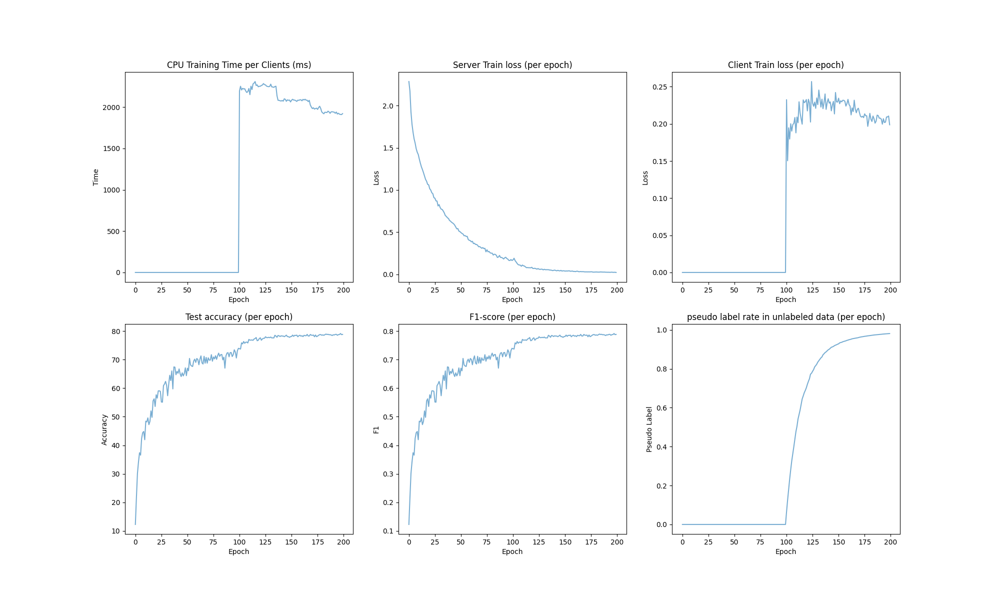
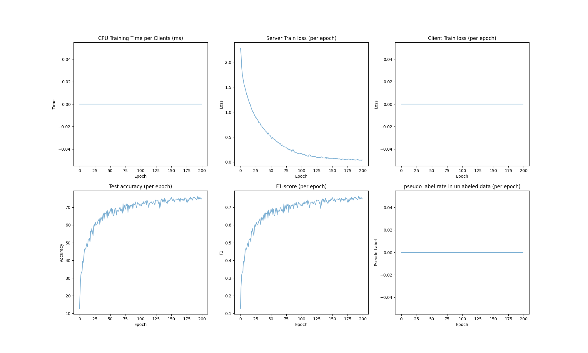
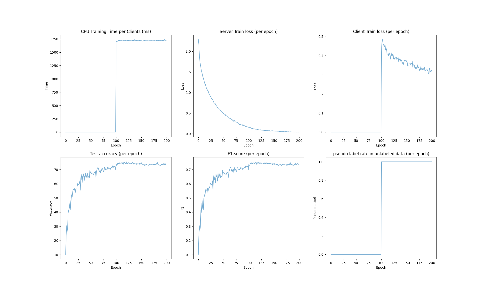
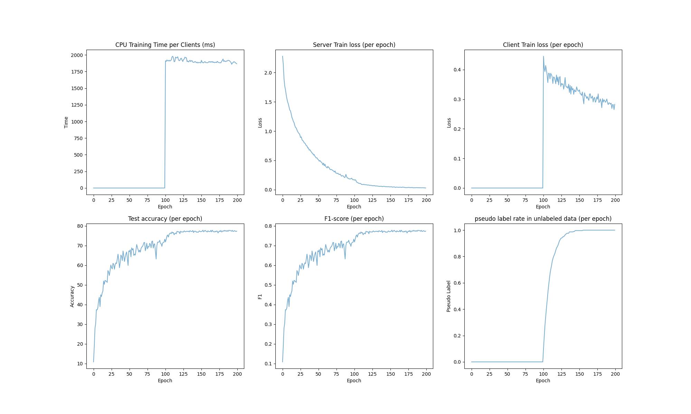
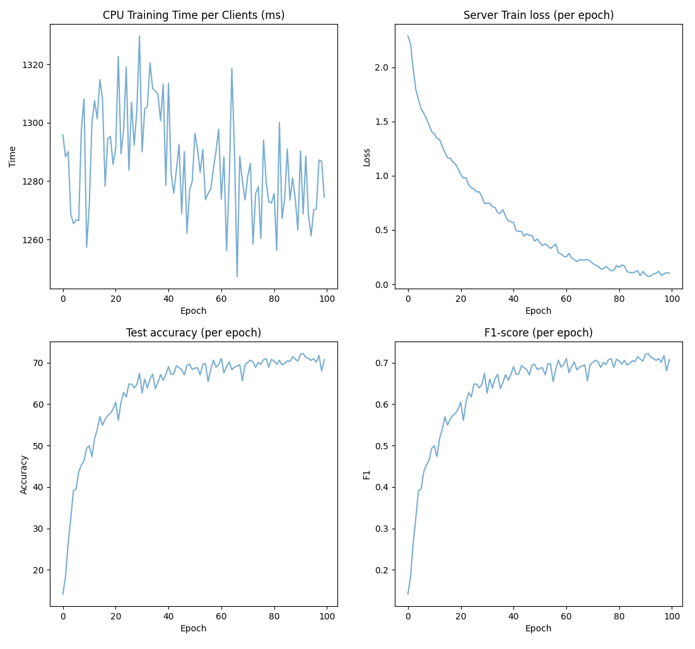
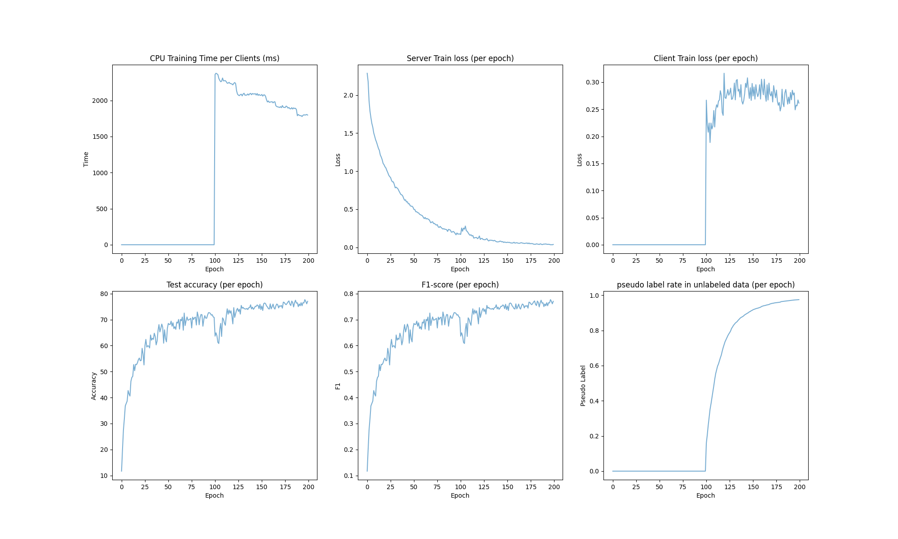
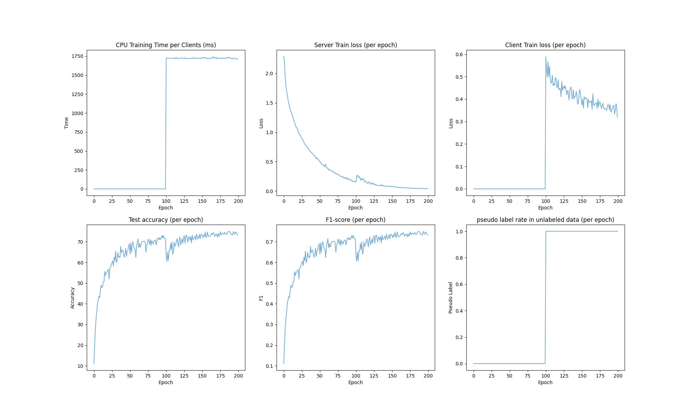
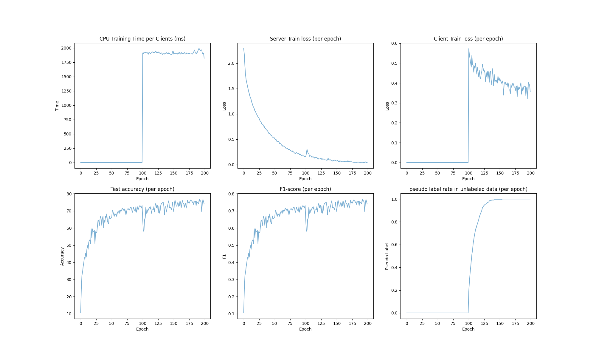
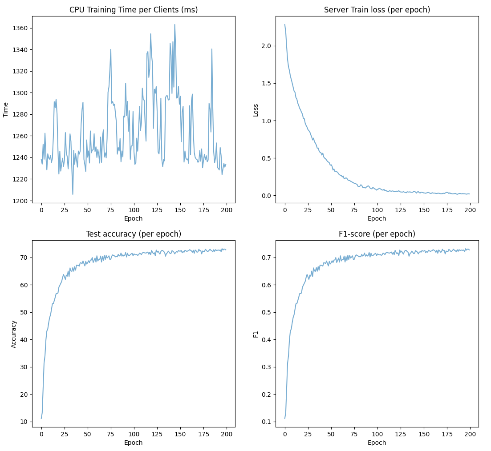
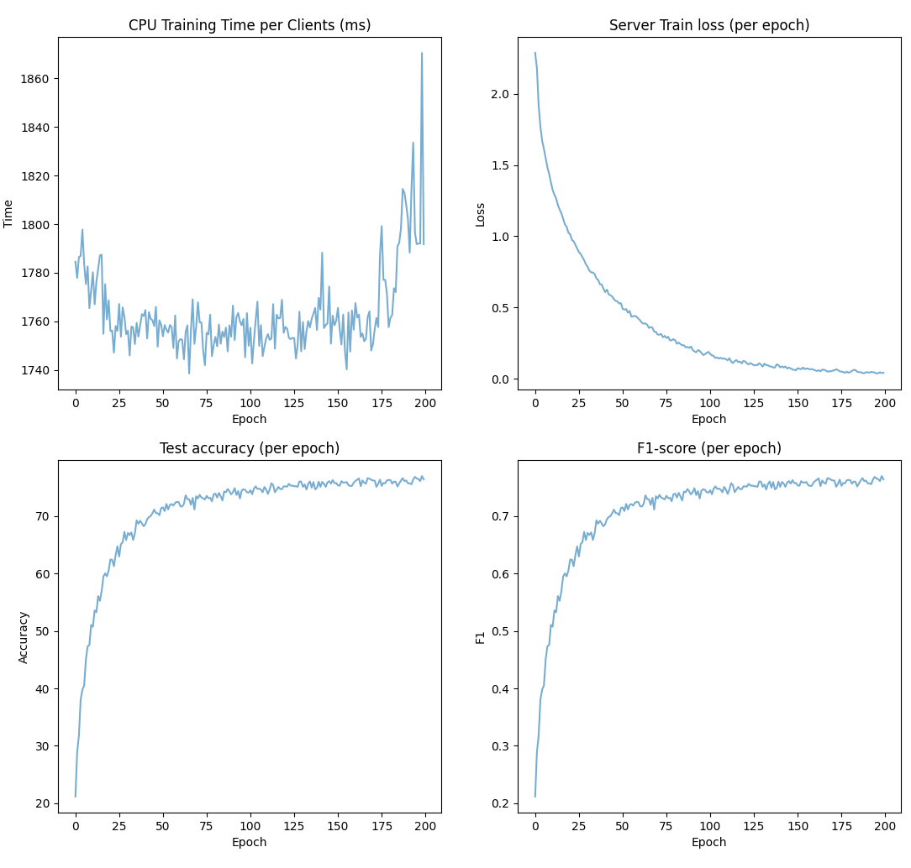

# FedSSL Framework on CIFAR-10 dataset

This report is the experiment analysis of federated semi-supervised learning framework on CIFAR-10 dataset.

## Framework Introduction

Our federated semi-supervised learning framework aims to set up a distributed ML baseline for IoT device scenarios. 
In this scenario, we assumes assumes that labels are only available at the server, while local clients/devices work with only unlabeled data. 
In the server side of our framework, we use the Cross-Entropy loss to train the model on the server data.
In the client side, we first utilize the pseudo labelling technique to generate the fake annotation for the unlabeled dataset and then train the model based on the pseudo labels.


## Hyperparameter Setting 

To begin with, I'rd like to introduce a few important parameters:

- epoch: the total communication round of model training, default as 200.
- init_epochs: we will skip the client-side training in the begin of training, default as 100.
- label_rate: the ratio of labeled data and the unlabeled data. Notices that the data size in server and clients will depends on label_rate, default as 0.1.
- num_users: the number of clients in total, default as 100.
- frac: the ratio of selected clients in each round client traning, default as 0.1.
- local_ep: the number of training epochs in each client training, default as 5.
- iid: iid if the data distribution in the clients is same, noniid otherwise. 
- threshold: the threshold of pseudo label generation, when the predicted probability is greater than the threshold, we generate the pseudo annotation, default as 0.9.

More hyperparameters is available on the /utils/options.py.

## Evaluation Setting

For the evaluation, we evaluate the metric below for each coummuncation round:

- training time per clients (ms)
- cross-entropy loss on the server training
- average of cross-entropy loss on the client traning
- accuracy on the testset
- f1-score on the testset
- pseudo label rate during the training.
<!-- - auc-score on the testset -->

For all the experiment below, we report the experiment for three times and take the average.

## Main Experiment

In the main experiment, we compare our FedSSL framework with simple nonFL training and another FedSSL bassline (FedSem, FedMix, FedMatch). We use the default setting and report the metric at communication round 200.

### IID setting

Compared with non FL framework, FedSSL framework could achieve higher accuracy and F1 score under the same communication round as the below table and picture.
Note that there is a significant increase in client time and client-side training loss because the first 100 rounds is warm-up round without client-side training. 

|  |Accuracy | F1 score|
|---    |---  |---   |
|non FL   |  75.05% | 0.75  |
|FedSem| 73.70%  | 0.74  |   
|FedSem_updated| 77.26%  | 0.77  | 
|FedMix| 73.02%  | 0.73  |  
|FedMatch| 76.50%  |  0.76 |
|FedSSL| 78.92%  | 0.79  | 


The results of our framework:


The results of non FL framework:


The results of updated FedSem framework:


The results of FedSem framework:


The results of FedMix framework:


The results of FedMatch framework:


### Non-IID setting


Similar to IID setting, our FedSSL framework outperforms the non FL framework but have a accuracy decrease compared with IID setting.

<!-- Compared with non FL framework, FedSSL framework could achieve higher accuracy ,F1, and AUC score under the same communication round as the below table and picture.
Note that there is a significant increase in client CPU time and client-side training loss because the first 15 rounds is warm-up round without client-side training.  -->


|  |Accuracy | F1 score|
|---    |---  |---   |
|non FL   |  75.05% | 0.75  |
|FedSem| 73.82%  | 0.74  |
|FedSem_updated| 75.27%  | 0.75  |
|FedMix| 72.93%  | 0.73  |  
|FedMatch| 76.47%  |  0.76 |  
|FedSSL| 76.72%  | 0.77 |  

The results of our framework:


The results of non FL framework:


The results of updated FedSem framework:


The results of FedSem framework:


The results of FedMix framework:


The results of FedMatch framework:


<!-- ## Ablation Study


Ongoing... -->

## How to run


### Step 1
```
pip install -r requirement.txt
```

### Step 2

run `python main_fedavg.py`
